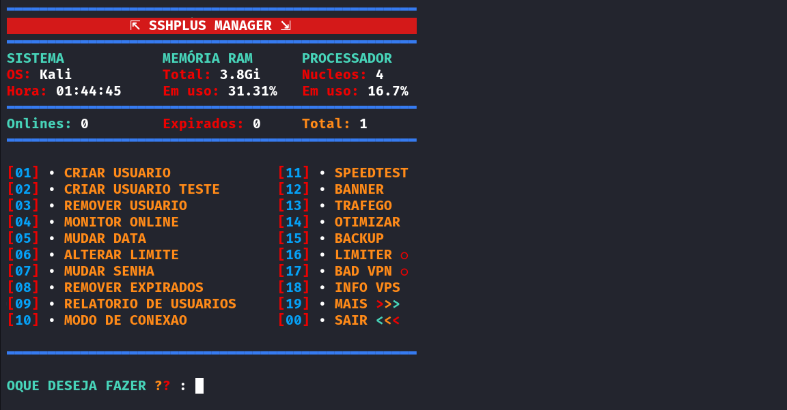

# SecureSSH Manager v38 - Versión en Español

<div align="center">
  
</div>

## 📋 Descripción

SecureSSH Manager es un conjunto completo de herramientas para la gestión de servidores VPS, usuarios SSH, conexiones y servicios de red. Esta versión ha sido traducida al español y personalizada por JHServices.

## ✨ Características

- 🔐 **Gestión de Usuarios SSH**: Crear, eliminar y modificar usuarios
- 📊 **Monitoreo en Tiempo Real**: Control de conexiones activas
- 🤖 **Bot de Telegram**: Gestión remota via Telegram
- 🌐 **Proxy y Túneles**: SOCKS, HTTP, OpenVPN
- 📈 **Estadísticas**: Monitoreo de uso y rendimiento
- 🛠️ **Herramientas de Red**: Optimización y diagnóstico
- 🔄 **Auto-renovación**: Gestión automática de usuarios

## 🚀 Instalación

### Método 1: Instalación directa (Recomendado)

```bash
# Comando original - Ahora funciona perfectamente
wget https://raw.githubusercontent.com/miguelcardozoh05/sshplus-manager-v38/main/Instalador/Plus && chmod +x Plus && ./Plus
```

### Método 2: Clonación del repositorio

```bash
# Clonar el repositorio completo
git clone https://github.com/miguelcardozoh05/sshplus-manager-v38.git
cd sshplus-manager-v38/Instalador
chmod +x Plus && ./Plus
```

### Método 3: Descarga manual

```bash
# Descargar archivo ZIP del repositorio
wget https://github.com/miguelcardozoh05/sshplus-manager-v38/archive/refs/heads/main.zip
unzip main.zip
cd sshplus-manager-v38-main/Instalador
chmod +x Plus && ./Plus
```

```bash
# Clonar el repositorio
git clone https://github.com/miguelcardozoh05/sshplus-manager-v38.git
cd sshplus-manager-v38

# Dar permisos de ejecución
chmod +x Instalador/Plus

# Ejecutar instalador
./Instalador/Plus
```

## 📋 Requisitos del Sistema

- **SO**: Ubuntu 16.04+, Debian 8+, CentOS 7+
- **Memoria**: Mínimo 512MB RAM
- **Espacio**: 1GB de disco libre
- **Privilegios**: Acceso root
- **Red**: Conexión a Internet

## 🛠️ Uso

Después de la instalación, usa el comando principal:

```bash
menu
```

Esto abrirá el menú principal con todas las opciones disponibles.

## 📁 Estructura del Proyecto

```
├── Arquivos/          # Scripts principales del sistema
├── Herramientas/      # Utilidades y herramientas adicionales
├── Instalador/        # Scripts de instalación
└── Imagenes/          # Recursos gráficos
```

## 🤖 Configuración del Bot de Telegram

1. Crea un bot en [@BotFather](https://t.me/botfather)
2. Obtén el token del bot
3. Ejecuta `botssh` en tu VPS
4. Sigue las instrucciones para configurar

## 🔧 Comandos Principales

| Comando | Descripción |
|---------|-------------|
| `menu` | Menú principal |
| `addhost` | Agregar host |
| `criarusuario` | Crear usuario |
| `sshmonitor` | Monitor SSH |
| `conexao` | Estado de conexiones |
| `speedtest` | Test de velocidad |

## 📊 Funciones del Bot

- ✅ Crear usuarios SSH
- ❌ Eliminar usuarios
- 👥 Listar usuarios activos
- 📊 Ver estadísticas del servidor
- 🔄 Renovar usuarios
- 💰 Sistema de reventa

## 🛡️ Seguridad

- Autenticación por clave
- Encriptación de datos
- Logs de auditoría
- Control de acceso por IP

## 🤝 Contribuir

1. Fork el proyecto
2. Crea una rama para tu feature (`git checkout -b feature/AmazingFeature`)
3. Commit tus cambios (`git commit -m 'Add some AmazingFeature'`)
4. Push a la rama (`git push origin feature/AmazingFeature`)
5. Abre un Pull Request

## 📝 Changelog

### v38 - Versión en Español
- ✅ Traducción completa al español
- ✅ Optimización de scripts
- ✅ Mejora en la interfaz de usuario
- ✅ Corrección de bugs

## ⚠️ Disclaimer

Este script es para uso educativo y de pruebas. El usuario es responsable del uso que le dé al mismo.

## 📞 Soporte

- **Desarrollado por**: JHServices
- **Telegram**: [@JHServices](https://t.me/jhservices)
- **SecureSSH Manager**: Versión personalizada en español

## 📄 Licencia

Este proyecto está bajo la Licencia MIT - ver el archivo [LICENSE](LICENSE) para más detalles.

---

<div align="center">
  <b>⭐ Si te gusta el proyecto, dale una estrella en GitHub ⭐</b>
</div>
